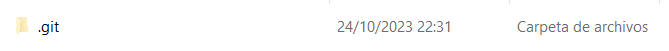
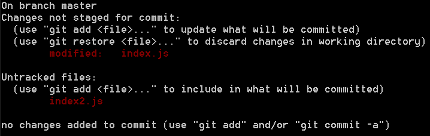
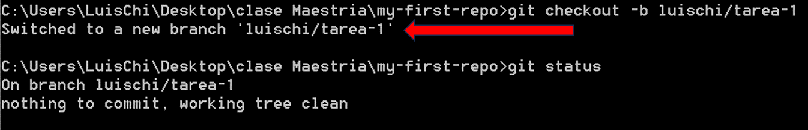
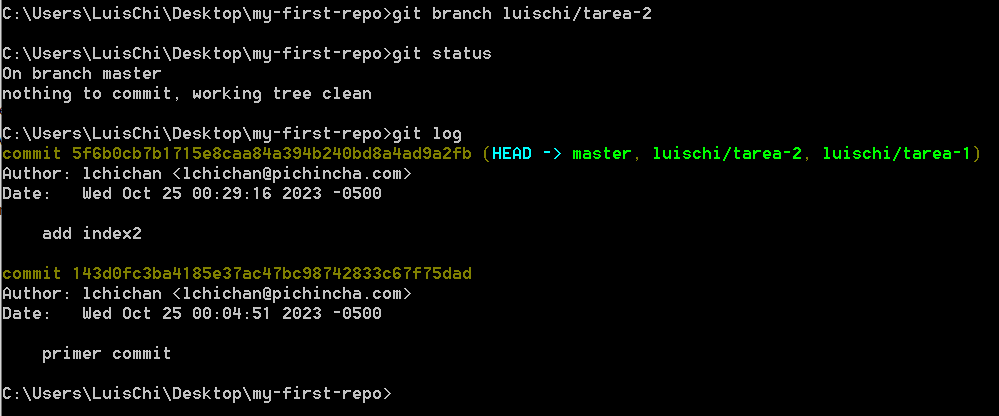
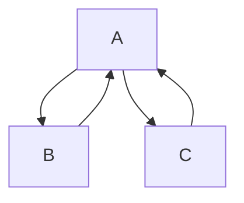

<h1 align="center">
  Git Commands
</h1>

`Git` es un software de control de versiones, pensando en la eficiencia, la confiabilidad y compatibilidad del mantenimiento de versiones de aplicaciones cuando estas tienen un gran número de archivos de código fuente.

> [!NOTE]
> Debes tener **Git** Instalado o actualizado https://git-scm.com/downloads.

Para comprobar la instalación ingresamos por **CMD** la siguiente línea de comando `git --version`  
El cual nos dará la versión que disponemos por ejemplo `git version 2.42.0.windows.2` caso contrario dará error y se tendrá que hacer la instalación.

A continuación, se detallará cada uno de los comandos de *Git* empezando por lo básico.

##  Git Basico

- `git config --global user.name "your name"` o `git config --global user.email "your email"`

Estos comandos de Git nos permiten setear el nombre y el correo en las configuraciones de Git.  
Para comprobar si están agregados ingresamos el siguiente comando `git config --list`  
Aparecerán muchas configuraciones relacionadas a Git pero la que acabamos de configurar es el name y email tal como se muestra en la siguiente imagen.


- `git init`

Para crear un repositorio local debemos crear una carpeta con un nombre y por Consola o CMD debemos ir a la carpeta con **cd** ya ubicado en la carpeta debemos inicializar, con el siguiente comando `git init`  


```
Initialized empty Git repository in C:/Users/LuisChi/Desktop/clase Maestria/my-first-repo/.git/
```
En la carpeta se nos crea un nuevo directorio **.git**



- `git status`

Este comando nos permite ver en que rama estamos, que cambios, nuevo por cambiar tenemos.  
La salida del comando es la siguiente
```
On branch master

No commits yet

Untracked files:
  (use "git add <file>..." to include in what will be committed)
        index.js

nothing added to commit but untracked files present (use "git add" to track)
```
otro ejemplo



- `git add index.js` o `git add .`

`git add index.js` este nos permite agregar los cambios por archivo.  
`git add .` este agrega todos los cambios de todos los archivos con cambios.  
Y con `git status` podemos ver los archivos con cambios que se agregaron
```
On branch master

No commits yet

Changes to be committed:
  (use "git rm --cached <file>..." to unstage)
        new file:   index.js
```
- `git commit -m "primer commit"`

Este comando crea un **commit** de todos los cambios agregados por el comando `git add .`  
La salida del comando es la siguiente
```
[master (root-commit) 143d0fc] primer commit
 1 file changed, 3 insertions(+)
 create mode 100644 index.js
 ```
- `git log`

Muestra todo los **commits** creados dentro del repositorio.
```
commit 5f6b0cb7b1715e8caa84a394b240bd8a4ad9a2fb (HEAD -> master)
Author: lchichan <lchichan@pichincha.com>
Date:   Wed Oct 25 00:29:16 2023 -0500

    add index2

commit 143d0fc3ba4185e37ac47bc98742833c67f75dad
Author: lchichan <lchichan@pichincha.com>
Date:   Wed Oct 25 00:04:51 2023 -0500

    primer commit
```
- `git diff`

Este comando nos permite ver los cambios echo en los archivos ya agregados por el comando `git add .`,  
los archivos nuevos no se ven cambios porque no tienen con que comparar.
```
diff --git a/index.js b/index.js
index 36ba89b..b59c02b 100644
--- a/index.js
+++ b/index.js
@@ -1,3 +1,6 @@
 function suma(a,b){
     return a+b;
+}
+function subtract(a,b){
+    return a-b;
 }
\ No newline at end of file
```

## Trabajo en equipo con Git

- `git checkout -b luischi/tarea-1` o `git branch luischi/tarea-1`

Estos comandos crean una rama a partir de la que estamos, la diferencia es que uno automáticamente nos pasa a la nueva rama y esto se logra con el `git checkout -b luischi/tarea-1`  
A continuación, podemos ver que con el `git status` nos dice que estamos en la nueva rama creada y que no tenemos cambios

```
C:\Users\LuisChi\Desktop\clase Maestria\my-first-repo>git checkout -b luischi/tarea-1
Switched to a new branch 'luischi/tarea-1'

C:\Users\LuisChi\Desktop\clase Maestria\my-first-repo>git status
On branch luischi/tarea-1
nothing to commit, working tree clean
```


Con el otro comando me crea la rama pero me mantengo en la **main o master** o en la rama que estemo.



- `git checkout master`

Este nos permite cambiarnos de rama


