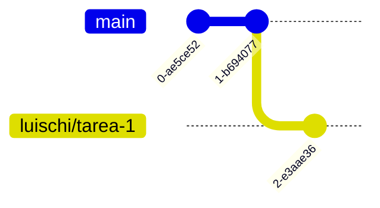
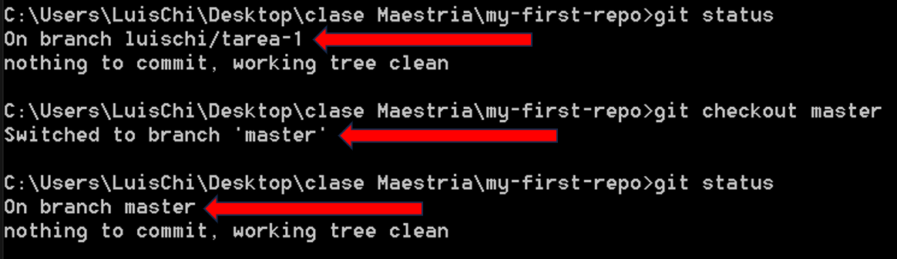

<h1 align="center">
  Git Commands
</h1>

`Git` es un software de control de versiones, pensando en la eficiencia, la confiabilidad y compatibilidad del mantenimiento de versiones de aplicaciones cuando estas tienen un gran número de archivos de código fuente.

> [!NOTE]
> Debes tener **Git** Instalado o actualizado https://git-scm.com/downloads.

Para comprobar la instalación ingresamos por **CMD** la siguiente línea de comando `git --version`  
El cual nos dará la versión que disponemos por ejemplo `git version 2.42.0.windows.2` caso contrario dará error y se tendrá que hacer la instalación.

A continuación, se detallará cada uno de los comandos de *Git* empezando por lo básico.

##  Git Basico

- `git config --global user.name "your name"` o `git config --global user.email "your email"`

Estos comandos de Git nos permiten setear el nombre y el correo en las configuraciones de Git.  
Para comprobar si están agregados ingresamos el siguiente comando `git config --list`  
Aparecerán muchas configuraciones relacionadas a Git pero la que acabamos de configurar es el name y email tal como se muestra en la siguiente imagen.


- `git init`

Para crear un repositorio local debemos crear una carpeta con un nombre y por Consola o CMD debemos ir a la carpeta con **cd** ya ubicado en la carpeta debemos inicializar, con el siguiente comando `git init`  


```
Initialized empty Git repository in C:/Users/LuisChi/Desktop/clase Maestria/my-first-repo/.git/
```
En la carpeta se nos crea un nuevo directorio **.git**


- `git status`

Este comando nos permite ver en que rama estamos, que cambios, nuevo por cambiar tenemos.  
La salida del comando es la siguiente
```
On branch master

No commits yet

Untracked files:
  (use "git add <file>..." to include in what will be committed)
        index.js

nothing added to commit but untracked files present (use "git add" to track)
```
otro ejemplo


- `git add index.js` o `git add .`

`git add index.js` este nos permite agregar los cambios por archivo.  
`git add .` este agrega todos los cambios de todos los archivos con cambios.  
Y con `git status` podemos ver los archivos con cambios que se agregaron
```
On branch master

No commits yet

Changes to be committed:
  (use "git rm --cached <file>..." to unstage)
        new file:   index.js
```
- `git commit -m "primer commit"`

Este comando crea un **commit** de todos los cambios agregados por el comando `git add .`  
La salida del comando es la siguiente
```
[master (root-commit) 143d0fc] primer commit
 1 file changed, 3 insertions(+)
 create mode 100644 index.js
 ```
- `git log`

Muestra todo los **commits** creados dentro del repositorio.
```
commit 5f6b0cb7b1715e8caa84a394b240bd8a4ad9a2fb (HEAD -> master)
Author: lchichan <lchichan@pichincha.com>
Date:   Wed Oct 25 00:29:16 2023 -0500

    add index2

commit 143d0fc3ba4185e37ac47bc98742833c67f75dad
Author: lchichan <lchichan@pichincha.com>
Date:   Wed Oct 25 00:04:51 2023 -0500

    primer commit
```
- `git diff`

Este comando nos permite ver los cambios echo en los archivos ya agregados por el comando `git add .`,  
los archivos nuevos no se ven cambios porque no tienen con que comparar.
```
diff --git a/index.js b/index.js
index 36ba89b..b59c02b 100644
--- a/index.js
+++ b/index.js
@@ -1,3 +1,6 @@
 function suma(a,b){
     return a+b;
+}
+function subtract(a,b){
+    return a-b;
 }
\ No newline at end of file
```

## Trabajo en equipo con Git

- `git checkout -b luischi/tarea-1` o `git branch luischi/tarea-1`

Estos comandos crean una rama a partir de la que estamos, la diferencia es que uno automáticamente nos pasa a la nueva rama y esto se logra con el `git checkout -b luischi/tarea-1`  
A continuación, podemos ver que con el `git status` nos dice que estamos en la nueva rama creada y que no tenemos cambios

```
C:\Users\LuisChi\Desktop\clase Maestria\my-first-repo>git checkout -b luischi/tarea-1
Switched to a new branch 'luischi/tarea-1'

C:\Users\LuisChi\Desktop\clase Maestria\my-first-repo>git status
On branch luischi/tarea-1
nothing to commit, working tree clean
```




Con el otro comando me crea la rama pero me mantengo en la **main o master** o en la rama que estemo.


- `git checkout master`

Este nos permite cambiarnos de rama



Como funciona esto de las **ramas** a continuación se observa un pequeño grafico el cual del nodo **A** vendría siendo main o master de el se desprenden nuevas ramas podemos podemos añadir código dependiendo del requerimiento.


Cuál es el objetivo de crear múltiples ramas es que los desarrolladores puedan trabajar simultáneamente sin intervenir en el trabajo del otro.

- `git branch`

Con `git branch` podemos ver todas las ramas que existen y además nos da la indicación en que rama nos encontramos ubicado.


- `git merge luischi/tarea-1`

Este comando sirve para unir una rama dentro de otra.  
Ya ejecutado nos dice que archivo se han agregado o han sufrido cambios.

```
C:\Users\LuisChi\Desktop\clase Maestria\my-first-repo>git merge luischi/tarea-1
Updating 5f6b0cb..bfb22e2
Fast-forward
 index.js | 3 +++
 1 file changed, 3 insertions(+)
 ```
 
 ```mermaid
  gitGraph
    commit
    commit
    branch luischi/tarea-1
    checkout luischi/tarea-1
    commit
    commit
    checkout main
    merge luischi/tarea-1
    commit
 ```

Hay que tener cuidado por que se da el caso de que en las diferentes ramas se trabajan con los mismos archivos o lineas y a la hora de unir aparecen conflictos tal como se muestra a continuación:

```
C:\Users\LuisChi\Desktop\clase Maestria\my-first-repo>git merge luischi/tarea2
Auto-merging index.js
CONFLICT (content): Merge conflict in index.js
Automatic merge failed; fix conflicts and then commit the result.
```
Esto sucedió porque dos desarrolladores trabajaron en las mismas líneas, en el código podemos ver que la función multiply es la que ya teníamos o la que se agrego a master en el primer merge y cuando se hiso el segundo merge ocurrió el conflicto por que agrego en la misma línea otra función llamada divide.


Como se soluciona primero revisar si necesitamos los dos cambios después solucionar manual mente, también el visual code o cualquier otra herramienta o Ide nos pude ayudar aceptando que cambios queremos mantener o ambos.

Si hacemos `git status` podemos ver que todavía aparece el conflicto. Después de eso lo agregamos con `git add .`

```
C:\Users\LuisChi\Desktop\clase Maestria\my-first-repo>git status
On branch master
You have unmerged paths.
  (fix conflicts and run "git commit")
  (use "git merge --abort" to abort the merge)

Unmerged paths:
  (use "git add <file>..." to mark resolution)
        both modified:   index.js

no changes added to commit (use "git add" and/or "git commit -a")
```

Después del `git add .` le hacemos git status y nos pedirá que hagamos un `git commit`

```
C:\Users\LuisChi\Desktop\clase Maestria\my-first-repo>git add .

C:\Users\LuisChi\Desktop\clase Maestria\my-first-repo>git status
On branch master
All conflicts fixed but you are still merging.
  (use "git commit" to conclude merge)

Changes to be committed:
        modified:   index.js
```
Automáticamente se nos abrirá un editor de consola el cual debemos guardarlo


Después de guardar se creará un nuevo **commit**

```
C:\Users\LuisChi\Desktop\clase Maestria\my-first-repo>git commit
[master 9870458] Merge branch 'luischi/tarea2'
```


## Git Avanzado

- `git rebase`

Sirve para reorganizar y modificar la estructura de un proyecto por ejemplo cambiar la descripción de un commit, ramas.  
Por ejemplo, si creamos una nueva rama a partir de master y agregamos un commit tanto en la nueva rama como en master con el rebase podemos modificar la estructura y es como que la nueva rama se haya creado a partir del ultimo commit agregado de master

```
C:\Users\LuisChi\Desktop\clase Maestria\my-first-repo>git rebase master
Successfully rebased and updated refs/heads/luischi/tarea3.
```
 `git rebase -i HEAD~2` o `git rebase -i dd3f048db34d1942e979be54523f792ac46d400a`

 Si queremos cambiar la descripción del commit podemos usar cualquiera de los dos la diferencia es que uno es por **id** commit y el otro es por numero de commit  
 Nos da una pequeña descripción de los comandos que podemos usar y la descripción del commit

 

 modificamos


- `git stash`

Si no queremos subir código incompleto git nos da la opción de agregarlo a una pila y mantenerlo en ella hasta que deseamos terminar o usar el código

```
C:\Users\LuisChi\Desktop\clase Maestria\my-first-repo>git stash
Saved working directory and index state WIP on (no branch): 60c54b1 uper
```

- `git stash list`

Para ver los todo lo que he agregado a mi pila usamos `git stash list`

```
C:\Users\LuisChi\Desktop\clase Maestria\my-first-repo>git stash list
stash@{0}: WIP on (no branch): 60c54b1 uper
```

- `git stash pop` o `git stash pop stash@{0}`

Con este comando me trae los cambios de mi pila y los borra de ella al mismo tiempo, funcionamiento de pila o tambien con la ubicacion.

```
C:\Users\LuisChi\Desktop\clase Maestria\my-first-repo>git stash pop
HEAD detached from refs/heads/luischi/tarea3
Changes not staged for commit:
  (use "git add <file>..." to update what will be committed)
  (use "git restore <file>..." to discard changes in working directory)
        modified:   index2.js

no changes added to commit (use "git add" and/or "git commit -a")
Dropped refs/stash@{0} (7f1237cfd2d67e29ef3d6e41205f37204dab81e2)
```

- `git stash apply stash@{0}`

Este comando tiene el mismo funcionamiento que el pop pero este no lo borra de la lista

```
C:\Users\LuisChi\Desktop\clase Maestria\my-first-repo>git stash apply stash@{0}
HEAD detached from refs/heads/luischi/tarea3
Changes not staged for commit:
  (use "git add <file>..." to update what will be committed)
  (use "git restore <file>..." to discard changes in working directory)
        modified:   index2.js

no changes added to commit (use "git add" and/or "git commit -a")
```

- `git checkout -- .`

Con este comando me permite borrar todos los cambios sin opción de recuperar, a contrario del git stash que si lo puedo recuperar

- `git cherry-pick 4cc956418f87fc63e7519af125dc15d67c3e609c`

Este comando lo que hace es copiar un commit y pegarlo en otra rama, hay que tener en cuenta que esto se usa cuando estemos seguro que no se usara merge.

```
C:\Users\LuisChi\Desktop\clase Maestria\my-first-repo>git cherry-pick 4cc956418f87fc63e7519af125dc15d67c3e609c
[master b75159a] add tem
 Date: Thu Oct 26 00:15:31 2023 -0500
 1 file changed, 3 insertions(+)
```
- `git revert b75159a9cf65c135a9affe6f4312e424299a7038`

Crea un commit para poder revertir un cambio que no estemos conforme

```
C:\Users\LuisChi\Desktop\clase Maestria\my-first-repo>git revert b75159a9cf65c135a9affe6f4312e424299a7038
[master 24d2bcf] Revert "add tem"
 1 file changed, 3 deletions(-)
```

## Github

Para esto debemos tener una cuenta creada en https://github.com/

Después de crear la cuenta procedemos a crear un nuevo repositorio.


Después de crear el repositorio ya nos da ciertas pautas de lo que debemos hacer para poder subir el código, pero la mayoría de esas pautas ya la hemos hecho.


Procedemos a subir el código a partir de un repo local, para ello agregamos un remoto después se procedió a cambiar la rama por **main** y después el **push** para subir o empujar al repositorio en **github**.

```
C:\Users\LuisChi\Desktop\clase Maestria\my-first-repo>git remote add origin https://github.com/luischigar/my-first-repo.git

C:\Users\LuisChi\Desktop\clase Maestria\my-first-repo>git branch -M main

C:\Users\LuisChi\Desktop\clase Maestria\my-first-repo>git push -u origin main
Enumerating objects: 23, done.
Counting objects: 100% (23/23), done.
Delta compression using up to 8 threads
Compressing objects: 100% (21/21), done.
Writing objects: 100% (23/23), 1.88 KiB | 641.00 KiB/s, done.
Total 23 (delta 7), reused 0 (delta 0), pack-reused 0
remote: Resolving deltas: 100% (7/7), done.
To https://github.com/luischigar/my-first-repo.git
 * [new branch]      main -> main
branch 'main' set up to track 'origin/main'.
```
